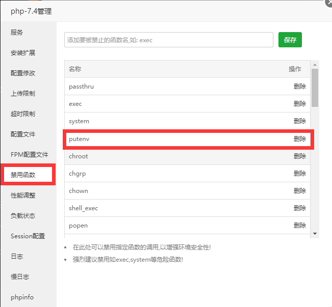

## 前言

（以下为官方 README 中文翻译）[Thanos github 仓库地址](https://github.com/aternosorg/thanos)

Thanos是一个PHP库，可以自动检测并删除Minecraft世界中未使用的区块。这可以将世界的文件大小减少50%以上。

除现有工具外，此库不使用 blocklist（我确实不知道这个该如何翻译）。相反，使用占用时间值来确定是否使用块。这可以防止使用过的块有时会被意外删除，并使此库与大多数mods和插件兼容。

目前，仅支持Minecraft Anvil世界格式（Minecraft Java版）。

## 安装

### 一些必须的环境

- PHP 7.4
- 脑子
- 手

顺带一提，这个 php 我是用宝塔面板装的（


### 开始

创建一个新的空文件夹，并执行以下命令安装（没 php 跑不了）：

```bash
composer require aternos/thanos
```

可能会提示一些函数 ` has been disabled for security reasons `，你去宝塔面板找到 php-7.4 管理，禁用函数，给报错的函数都开开就行了。



删除完了别忘了再跑一遍 `composer require aternos/thanos`。

### 使用

在 **根目录下** 运行

```bash
./vendor/aternos/thanos/thanos.php 世界文件夹名称 输出文件夹名称
```

**运行之前记得关掉游戏**

等待一段时间，可能要很久，当出现 `Removed xxx chunks in xxx seconds` 时即说明优化完成。此时输出文件夹内就是优化完的存档。


但是，如果你的存档过大，这个命令要运行很久，这个命令无法提供当前的优化进度，如果死机了你也不知道。那你可以使用我写的脚本：

```php
#!/usr/bin/php
<?php

use Aternos\Thanos\Helper;
use Aternos\Thanos\Thanos;
use Aternos\Thanos\World\AnvilWorld;

require_once 'vendor/autoload.php';

$startTime = microtime(true);
$world = new AnvilWorld("D:/MinecraftServer/backup/world", "D:/MinecraftServer/world");
$cnt = 0;

echo "Copying other files...\n";
$world->copyOtherFiles(); //copy non-region files

foreach ($world as $chunk){
  if($chunk->getInhabitedTime() > 0){
    $chunk->save();
  }
  else {
    $cnt++;
    echo "Removed $cnt chunks\n";
  }
}
```

具体使用方法：打开此目录 `\vendor\aternos\thanos`，打开 `thanos.php`，将里面的代码替换为我提供的代码。最后退回到根目录运行 `./vendor/aternos/thanos/thanos.php 世界文件夹名称 输出文件夹名称` 命令即可。


