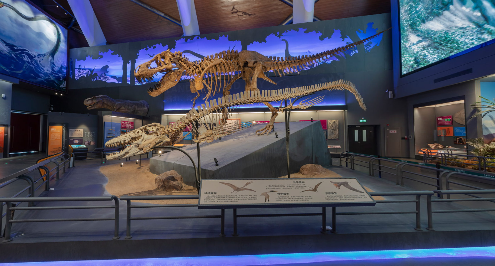
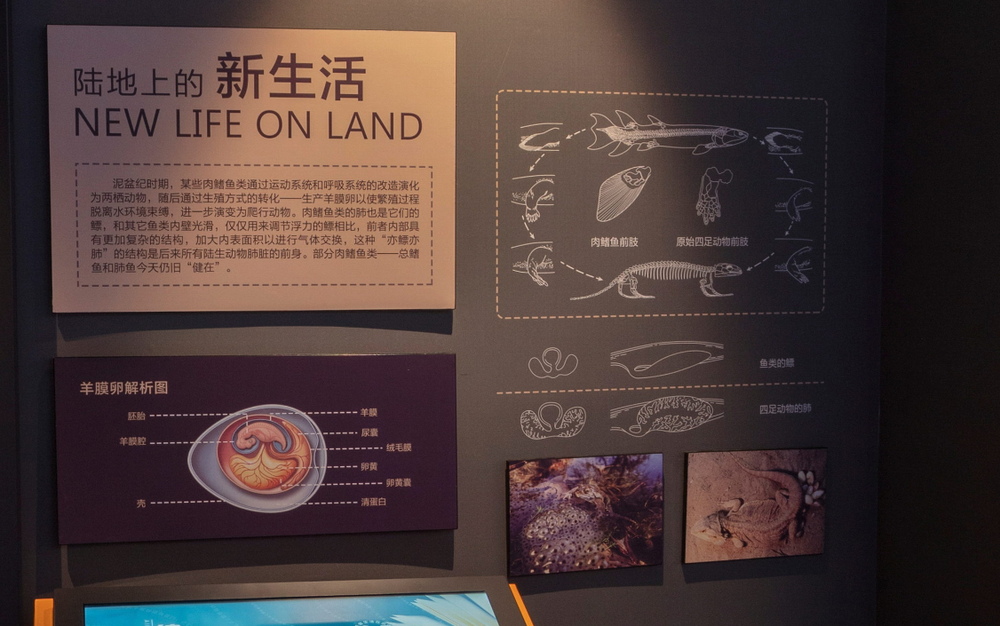
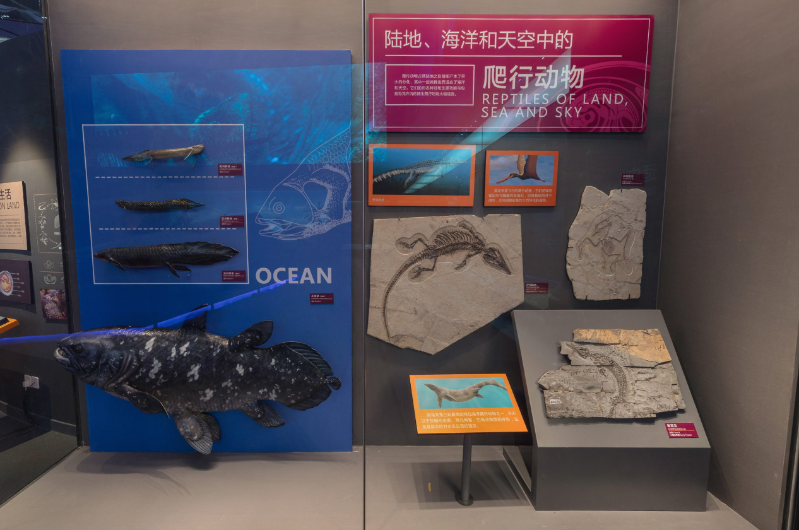
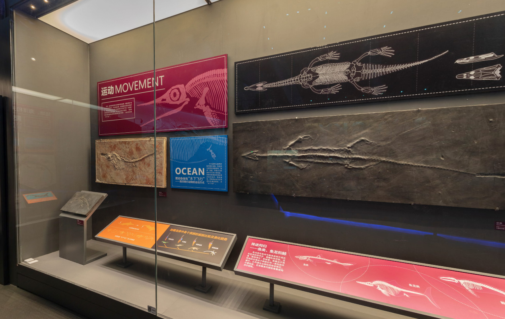
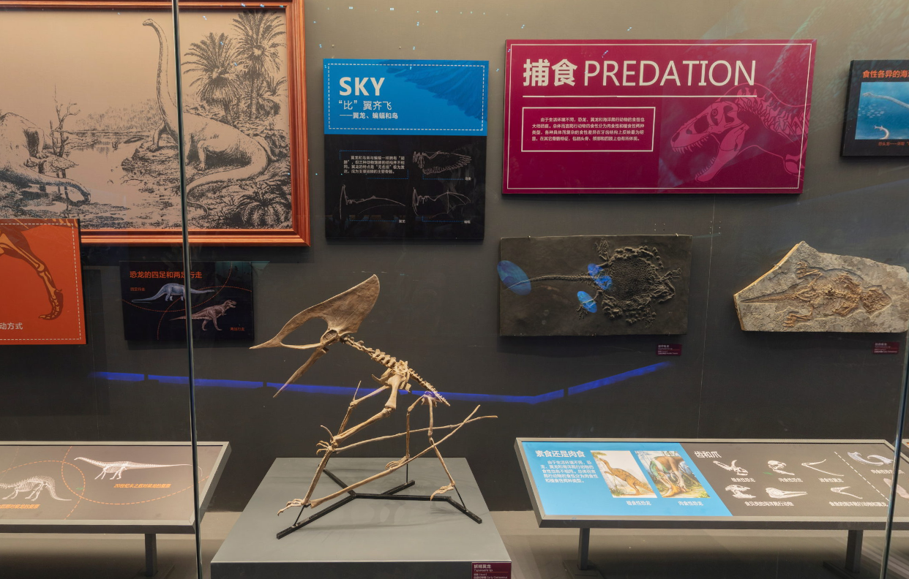
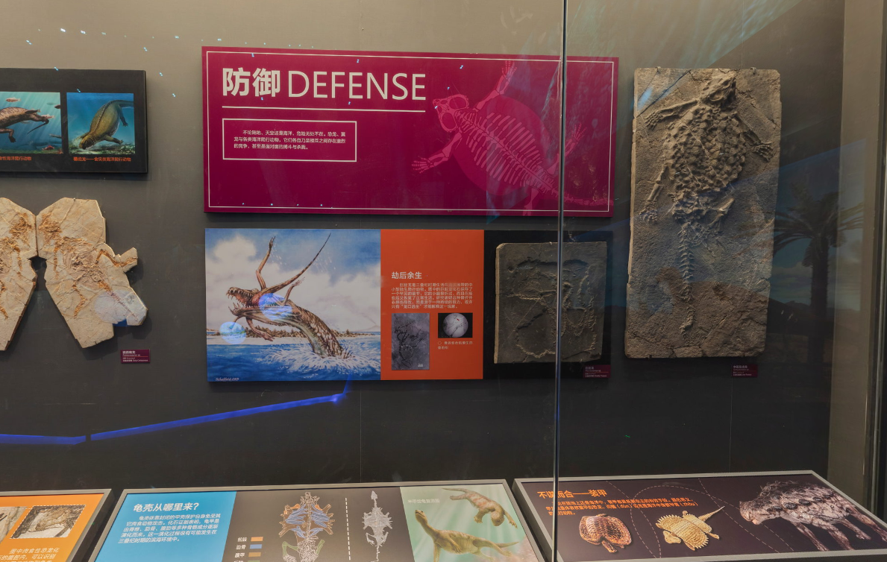
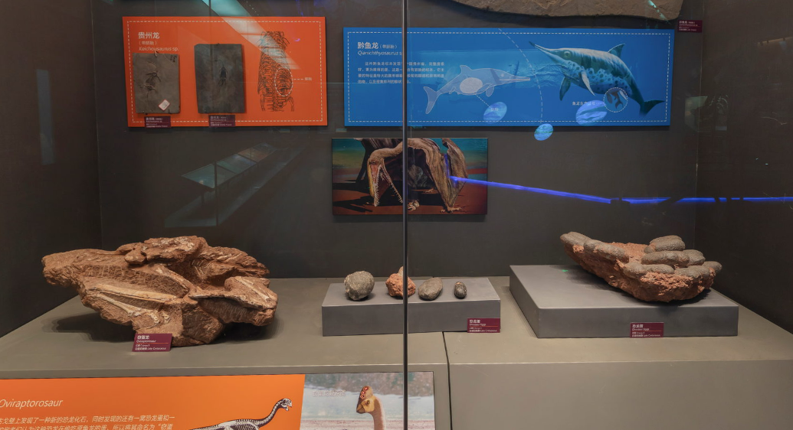
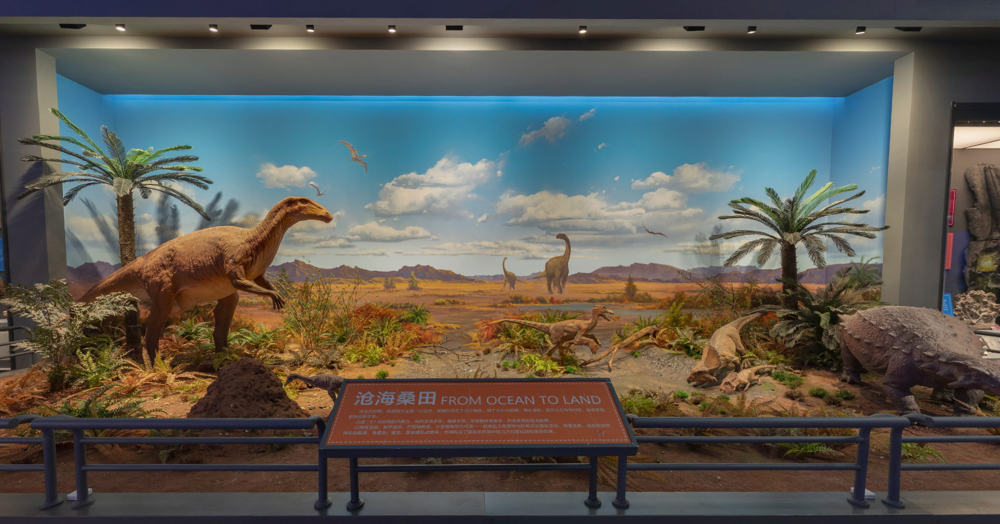
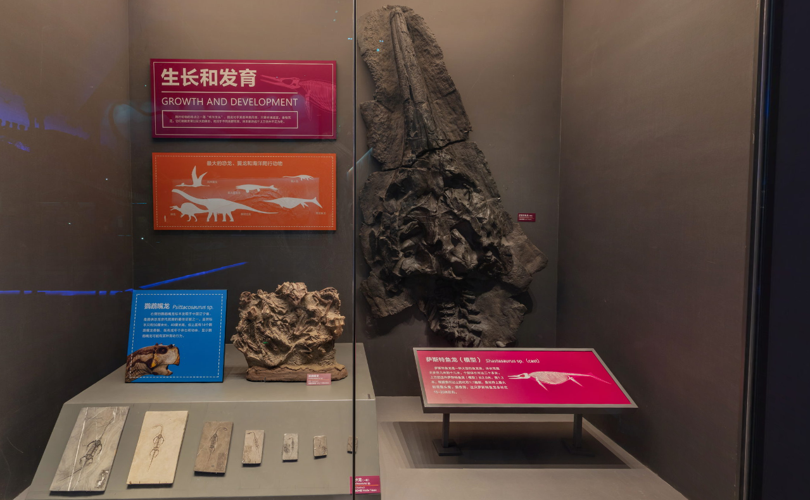
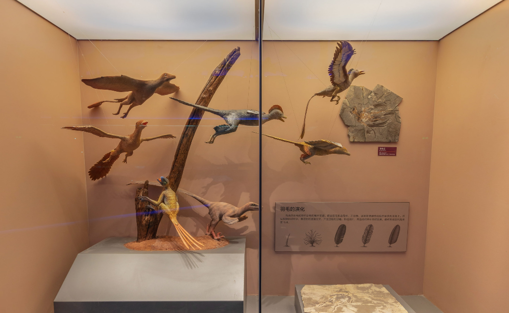

暑假期间，我参观了国家海洋博物馆。令我印象最深的展厅被称为“龙的时代”。

## 龙的时代

### 爬行动物的诞生

> 爬行动物的前身是两栖动物和鱼类。在距今 3.6 亿年以前的泥盆纪时期，肉鳍鱼类登上陆地成为两栖动物，进而演变为爬行动物。对于鱼类为何放弃水而上岸，有两种解释。曾经的解释是：**在泥盆纪晚期某些鱼类为了寻找新的水源而离开逐渐干涸的湖泊，爬上陆地**；另一种解释是：**泥盆纪的干旱期来临时，某些“预先适应”——业已装备了“四肢”和“肺”的鱼类得以通过器官功能的转换而获取陆地上的生存机会。**

这两种解释分别对应了生物进化论的两个重要观点：

- **第一种解释：**对应的是**自然选择理论**。 自然选择理论认为，生物在生存斗争中，具有有利变异的个体更容易生存下来，并繁殖后代，而具有不利变异的个体则被淘汰。这段话中，干涸的湖泊环境导致了鱼类生存的压力，那些能够离开水源寻找新的生存环境的鱼类获得了生存优势，最终演化成两栖动物。
- **第二种解释：** 对应的是**预适应理论**。 预适应理论认为，生物在进化过程中，某些性状一开始可能没有明显的生存优势，但当环境发生改变时，这些性状可能就会成为有利的适应性特征。这段话中，某些鱼类已经具备了“四肢”和“肺”，这些性状在水环境中可能没有明显优势，但当环境干旱时，这些性状却成为了生存的关键，最终帮助这些鱼类适应了陆地环境。

这两种解释都从不同的角度解释了生物进化的机制，第一种解释强调环境压力对生物进化的驱动作用，而第二种解释则强调生物本身的性状和环境变化之间的关系。

### 陆地上的新生活 | 陆地、海洋和天空中的爬行动物

>  泥盆纪时期，某些肉鳍鱼类通过运动系统和呼吸系统的改造演化为两栖动物，随后通过生殖方式的转化——生产羊膜卵以使繁殖过程脱离水环境束缚，进一步演变为爬行动物。肉鳍鱼类的肺也是它们的鳔，和其它鱼类内壁光滑，仅仅用来调节浮力的鳔相比，前者内部具有更加复杂的结构，加大内表面积以进行气体交换，这种“亦鳔亦肺”的结构是后来所有陆生动物肺脏的前身。部分肉鳍鱼类——总鳍鱼和肺鱼今天仍旧日“健在”。

> 爬行动物占领陆地之后随即产生了巨大的分化，其中一些类群进而适应了海洋和天空，它们的形态特征和生理功能与包括恐龙在内的陆生爬行动物大相径庭。

这两段话讲述了从水生到陆生，再到适应海洋和天空的生物演化过程，展现了生物进化的多样性和适应性的特点，并强调了“预适应”和“分化”在这一过程中的重要作用。

- **生物演化是一个从水生到陆生，再到适应不同环境的过程：** 从肉鳍鱼类到两栖动物，再到爬行动物，最后演化出适应海洋和天空的物种，这一过程展现了生物对环境的适应能力，以及从水生到陆生的演化趋势。
- **“预适应”为生物演化提供了基础：** 肉鳍鱼类的“亦鳔亦肺”结构原本是为了调节浮力，但在环境变化的情况下，它却成为了适应陆地环境的关键，最终演化成了肺脏。这说明生物体自身结构的多功能性为适应新的环境提供了可能。

- **适应性分化是生物演化的重要方式：** 爬行动物占领陆地后，为了适应不同的环境，产生了巨大的分化，例如有的适应了海洋，有的适应了天空，它们的形态和生理功能都发生了巨大的变化。这说明生物演化是一个不断适应环境、产生多样性的过程。

### 运动 | 捕食 | 防御 | 繁殖

> 恐龙、翼龙和海洋爬行动物身体结构迥异，因而采取了完全不同的运动方式。作为陆地动物，恐龙通常为四足和两足行走；翼龙依靠前肢与后肢之间的翼膜在天空中飞翔；海洋爬行动物的运动方式相对复杂，其中最为特化的有两种，一是鱼龙类近似鱼类那样依靠摆动尾部驱动身体前进，二是蛇颈龙类的“水下飞行”。

> 由于生活环境不同，恐龙、翼龙和海洋爬行动物的食性也大相径庭。总体而言爬行动物的食性分为肉食性和植食性两种类型，各种具体而复杂的食性差异在牙齿结构上反映最为明显，在其它骨骼特征，包括头骨、颈部和四肢上也有所体现。

> 不论陆地、天空还是海洋，危险无处不在。恐龙、翼龙与各类海洋爬行动物，它们各自乃至相互之间存在激烈的竞争，甚至是面对面的搏斗与杀戮。

> 爬行动物是卵生动物，但是对于某些类群来说，它们的卵不是在外界环境中，而是在母体内孵化的，所以看起来是“胎生”——幼子直接娩出。已知的化石证据显示，恐龙是卵生的、翼龙也是卵生的、海洋爬行动物是“胎生”的。

这些文字详细地描述了恐龙、翼龙和海洋爬行动物的身体结构、运动方式、食性以及繁殖方式，并强调了它们之间的相互竞争和生存斗争。这些特征都与进化论的理论相符，体现了生物的适应性进化。

* **适应性进化：** 恐龙、翼龙和海洋爬行动物分别适应了陆地、天空和海洋的环境，并演化出了不同的身体结构和运动方式。例如，恐龙的四肢适应陆地行走，翼龙的翼膜适应飞行，海洋爬行动物则演化出水生适应特征。这体现了生物为了适应环境而不断演化的过程，是自然选择的结果。
* **食性分化：** 不同的食性反映了不同生物对资源的利用方式，以及它们在生态系统中的角色。例如，肉食性动物以其他动物为食，植食性动物则以植物为食。这段文字提到爬行动物食性分化，反映了自然界中生物之间复杂的相互关系，以及在资源竞争下物种演化的多样性。
* **竞争与生存斗争：** 恐龙、翼龙和海洋爬行动物之间的竞争，以及它们与其他生物的生存斗争，是自然选择的重要推动力。只有适应性更强的物种才能在竞争中胜出，并留下后代，将自己的基因传递下去。这体现了自然选择对生物进化的重要性。
* **繁殖方式：** 爬行动物的卵生繁殖方式，以及某些海洋爬行动物的“胎生”方式，都是生物适应环境的结果。例如，海洋环境对卵的保护要求更高，因此一些海洋爬行动物演化出在母体内孵化的方式，以提高后代的生存率。这体现了生物为了适应环境而不断演化繁殖方式，并最终影响物种演化方向的机制。

这段文字通过描述恐龙、翼龙和海洋爬行动物的特征，展现了生物在漫长的演化过程中，为了适应环境而不断改变的适应性进化过程。这些特征都与进化论的理论相符，体现了生物的多样性、适应性以及自然选择的重要作用。

### 沧海桑田

> 中生代初期，我国南方还是一片汪洋，陆地只存在于北方地区。到了中生代后期，海水退却，南方北方均为内陆，后者变得更加炎热干旱。
> 白垩纪时期的内蒙古，自然生境多样，植被丰茂，孕育着种类繁多、形态各异的恐龙族群。以鸭嘴龙类、装甲龙类，巨型蜥脚类，小型兽脚类为代表——后者包含高度特化的阿尔瓦雷斯龙类、窃蛋龙类，这些恐龙同伴生的鳄类、龟鳖类、翼龙、原始哺乳动物等，共同构成了复杂多样的中国北方白垩纪陆相生态系统。

### 生长和发育

> 爬行动物的特点之一是“终生生长”，因此对于某些种类而言，只要环境适宜，食物充足，它们就能发育出巨大的体形，而对于不同类群而言，体形差距成千上万倍并不足为奇。

 ### 羽毛的演化

> 鸟类的羽毛和爬行动物的鳞片同源，原始羽毛形态简单，不分枝，这种简单结构出现在很多恐龙身上。在后期演化过程中，单枝结构逐渐分叉，产生羽枝和羽轴，形成羽片，并由对称向不对称发展，最终形成现代鸟类的飞羽。

这段文字描述了鸟类羽毛的演化过程，并将其与爬行动物的鳞片联系起来，体现了生物进化的同源性、渐进性、适应性演化的特点，以及化石在其中的重要作用。

- **同源性**

  鸟类羽毛和爬行动物鳞片同源，表明它们起源于共同的祖先，并随着时间的推移，逐渐演化出不同的形态和功能。

  这体现了生物进化的一个重要特点：同源性，即起源于同一个祖先，但形态和功能发生改变。

- **渐进性**

  羽毛的演化过程是一个循序渐进的过程，从简单的单枝结构到分叉的羽枝和羽轴，再到形成羽片，最终演化出对称和不对称的飞羽。

  这体现了生物进化的另一个重要特点：渐进性，即生物的演化不是突然发生的，而是通过漫长的积累过程，逐渐发生变化。

- **适应性演化**

  羽毛的演化与鸟类的飞行能力密切相关。从简单的单枝结构到复杂的飞羽，羽毛的演化使得鸟类能够更好地适应飞行生活，并最终演化出各种各样的飞行模式。

  这体现了生物进化的核心驱动力：自然选择，即适应环境的生物更容易生存和繁殖，并将有利的性状遗传给后代，最终导致物种的进化。

- **化石是生物进化过程的重要证据**

  越来越多的化石证据表明，恐龙与鸟类之间存在密切的演化关系，而羽毛的演化则是这一关系的重要证据之一。

### 结束语

> 在6600万年前的白垩纪之末，“龙”的时代终结了。陆地上的恐龙，天空中的翼龙以及海洋中的蛇颈龙、鱼龙，从地球上永远地消失了。今天的人们热衷于探究有关它们的一切，甚至为之着迷。这毫不奇怪，因为这些史前生命是如此美丽、优雅和神秘。这些远古地球居民的历史长达亿万年，相比之下，人类200万年的发展史是如此短暂，短暂到让今天的我对“龙”的时代还只有一知半解。幸运的是，只要你留神，就可以发现那个时代留下的蛛丝马迹：也许是历尽艰辛所寻觅到的化石骨骸，也许是你家后院里悠闲踱步的母鸡。

